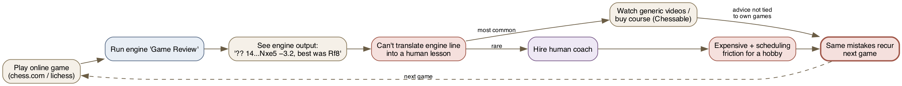
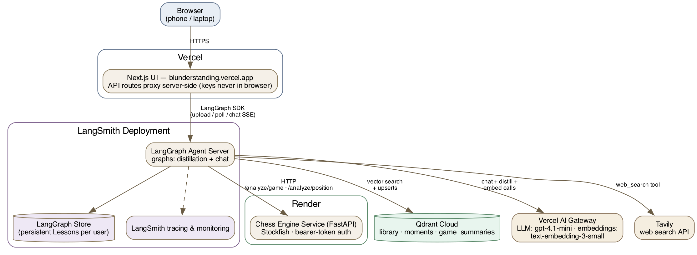
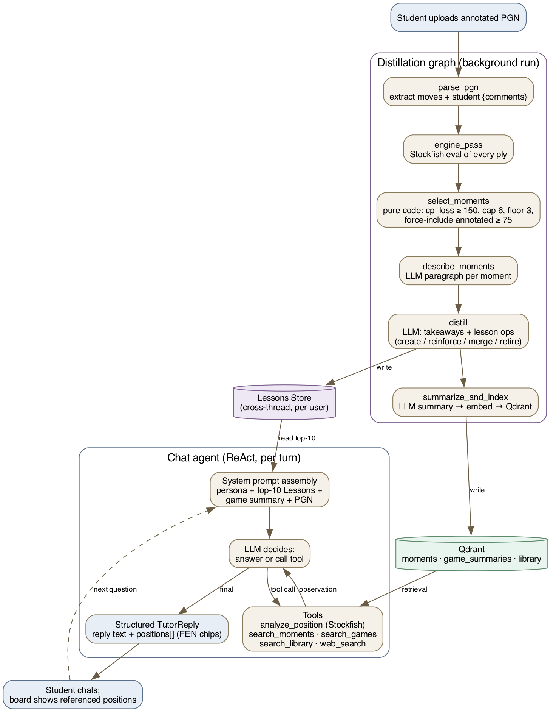

# Blunderstanding — Chess Tutor Agent

> Certification Challenge submission · AI Engineering Certification v1.0

A web-based chess coach that reads your annotated games, identifies your
recurring mistakes, and remembers them across every game you've ever uploaded —
like a real coach's notebook.

**Live demo:** https://blunderstanding.vercel.app  
**Loom walkthrough:** _link after recording_

---

## Certification Task Answers

### Task 1 — Problem & Audience

Adult chess improvers, especially early intermediate players, need personalized feedback after each game to increase their skills.

The audience I'm targetting for this problem is early/intermediate Adult chess improvers. Adults who play chess as a hobby and strive to get better because of the feeling of satisfaction from getting better. Unlike a lot of hobbies, you can literaly see this concretely from a number called an elo rating which tells you how you stack against other players. Since the pandemic, and the release of the widely popular Queen's gambit series, there's been a massive spike in popularity. I've personally seen decently sized communities online of adult improvers, who spend lots of practicing and are even willing to spend money to buy courses (e.g. chessable) and fly to tournaments. 

**How the user solves this today:**



There's a lot of generic resources online, but personalized feedback is ideal. Chess.com for example has a game review option, but it's really hard for someone who's not very skilled to understand the results, because the review relies on a game engine. And engines are A LOT better than humans now and don't play in very "human" ways. So a "mistake" might not actually be a mistake practically speaking for a hobbyist. As mentioned before, adults may be willing to pay money and invest the time, but not necessarily for coaching. Coaching can be expensive, especially for a side hobby (if you start as an adult, you're very very VERY unlikely to become a pro lol). It can also be hard to coordinate schedules.

Output can be evaluated against--------

### Task 2 — Solution

A Agentic Chess Tutor for Adult Chess improvers

**Infrastructure:**



**Agent workflow (distillation graph + chat agent):**



    1. LLM(s) - 
    2. Agent orchestration framework -
    3. Tool(s) - 
    4. Embedding model - 
    5. Vector Database - 
    6. Monitoring tool - 
    7. Evaluation framework - 
    8. User interface - 
    9. Deployment tool
    10. Any other components you need

### Task 3 — Data

| Collection | Content | Chunking strategy |
|---|---|---|
| `library` | Public-domain classics (Capablanca, Lasker) via Gutenberg | Book's own section headings; long sections split with RecursiveCharacterTextSplitter(1000/100) |
| `moments` | Key positions from the Student's games | One Moment = one position + LLM-written description paragraph |
| `game_summaries` | Per-game summary paragraphs | One row per game |

**External API:** Tavily web search (`web_search` tool in the chat agent).

### Task 4 — Prototype

- **UI (public entry point):** https://blunderstanding.vercel.app
- **Agent:** LangSmith deployment https://chess-tutor-e7b2caed588f50fcaace1374635bf330.us.langgraph.app (API-key protected; called server-side by the UI's API routes)
- **Engine Service:** Render https://chess-engine-server-hbp2.onrender.com (bearer-token protected; `/healthz` is public)
- **Vector store:** Qdrant Cloud (`library` corpus ingested: 419 chunks)

### Task 5 — Evaluations

See `evals/results/` for committed tables.

- **Retrieval eval:** Ragas over `library` + `moments` (faithfulness, answer
  relevancy, context precision/recall). ~40 synthetic + 12 golden QA pairs.
- **Distillation eval:** ~15–20 CC0 lichess games with planted misconceptions;
  Takeaway precision/recall + LLM-as-judge coaching rubric.

### Task 6 — Advanced Retriever + Improvement

1. **Advanced retriever:** BM25 + dense `EnsembleRetriever` on `library` and
   `moments`. Chess vocabulary ("Caro-Kann", "skewer", "f7") is exact-match-
   sensitive; pure semantic search blurs it. Before/after Ragas table in
   `evals/results/`.
2. **Model swap:** `DISTILL_MODEL` env var changed from `gpt-4.1-mini` to
   stronger model through the gateway. Before/after precision/recall table in
   `evals/results/`.

### Task 7 — Next Steps

See `PRD.md §7`:
- Puzzle curriculum from CC0 lichess puzzle DB matched to Lessons
- Maia-3 / rating-adaptive feedback depth
- Chessformer position-native embeddings replacing describe-then-embed
- Real authentication + chess.com/lichess account sync
- Interactive board play

---

## Local Development

```bash
cp .env.example .env
# fill in API keys

make build         # first run (builds images)
make up            # subsequent runs

# localhost:3001   — UI
# localhost:8000   — LangGraph backend
# localhost:8001   — Engine service
# localhost:6333   — Qdrant

# Run unit tests (no Docker needed):
make test-unit
make test-engine

# Run integration tests (requires Docker):
make test-integration

# Ingest library corpus into Qdrant:
make ingest
```

## Repo Layout

```
chess-tutor/
├── src/
│   ├── frontend/           # Next.js → Vercel
│   ├── backend/            # LangGraph agent → LangSmith
│   └── chess-engine-server/# FastAPI + Stockfish/Maia-2 → Render
├── scripts/                # ingestion + benchmark data fetch
├── evals/                  # evaluation harness
├── docs/adr/               # architecture decision records
├── docker-compose.yml      # local dev
└── docker-compose.test.yml # integration tests
```
